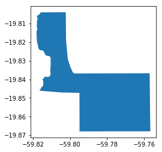
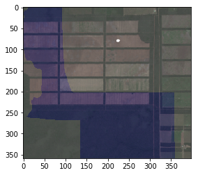
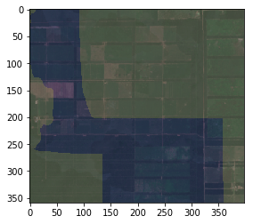
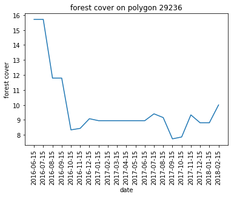

# Deforestation in northern Paraguay

The Chaco in Paraguay is a large area of about 150.000 square kilometers where heavy deforestation takes place. Monitoring complience in this area is an enormous challange. This notebook demonstrates the power of the Ellipsis-API to cope with this challange.

Deforestation falls into three classes. Deforesation for which a permit has been granted, illegal deforestation in reserves of various types, and deforestation outside reserves for which no permit is administered. We will have a look at all of these.

## Setting things up

We will be requiring the following python packages


```python
import requests
import pandas as pd
from io import StringIO
import geopandas as gpd
import numpy as np
from rasterio.features import rasterize
import matplotlib.pyplot as plt
from call_query import visualise_bbox
```

Furthermore we are going to use the following utility function to draw polygons over an image


```python
def polys_on_image(im, polys, alpha):
    polys.crs = {'init': 'epsg:4326'}
    polys = polys.to_crs({'init': 'epsg:3395'})
    transform = rasterio.transform.from_bounds(polys.bounds['minx'], polys.bounds['miny'], polys.bounds['maxx'], polys.bounds['maxy'], im.shape[0], im.shape[1])

    raster = rasterize( shapes = [ (polys['geometry'].values[m], 1) for m in np.arange(polys.shape[0]) ] , fill = 0, transform = transform, out_shape = (im.shape[0], im.shape[1]), all_touched = True )

    raster = np.stack([np.zeros(raster.shape),np.zeros(raster.shape), raster, raster ], axis = 2)

    image = im * (1 - alpha) + raster*alpha 
    return(image)
```

Now let's save the url that we need in a varialbe to shorten our code further on.


```python
url = 'https://api.ellipsis-earth.com/'
```

Furthermore let's store the id of the chaco_demo map in a variable as well.


```python
r = requests.post(url + 'queries/publicMaps')

r = pd.read_csv(StringIO(r.text))

map_id = r[r['name'] == 'Chaco Demo 2']['map_id'].values[0]
```

To get an idea of the available data in this map we are printing all timestamps, classes, maplayers and polyognsLayers below.

First for the timestamps:


```python
r = requests.post(url + 'queries/timestamps_map',
                 data = {"mapId":  map_id })

r = pd.read_csv(StringIO(r.text))
r
```


<div>
<style scoped>
    .dataframe tbody tr th:only-of-type {
        vertical-align: middle;
    }

    .dataframe tbody tr th {
        vertical-align: top;
    }

    .dataframe thead th {
        text-align: right;
    }
</style>
<table border="1" class="dataframe">
  <thead>
    <tr style="text-align: right;">
      <th></th>
      <th>timestamp</th>
      <th>date_from</th>
      <th>date_to</th>
    </tr>
  </thead>
  <tbody>
    <tr>
      <th>0</th>
      <td>0</td>
      <td>2016-01-01</td>
      <td>2016-01-15</td>
    </tr>
    <tr>
      <th>1</th>
      <td>1</td>
      <td>2016-02-01</td>
      <td>2016-02-15</td>
    </tr>
    <tr>
      <th>2</th>
      <td>2</td>
      <td>2016-03-01</td>
      <td>2016-03-15</td>
    </tr>
    <tr>
      <th>3</th>
      <td>3</td>
      <td>2016-04-01</td>
      <td>2016-04-15</td>
    </tr>
    <tr>
      <th>4</th>
      <td>4</td>
      <td>2016-05-01</td>
      <td>2016-05-15</td>
    </tr>
    <tr>
      <th>5</th>
      <td>5</td>
      <td>2016-06-01</td>
      <td>2016-06-15</td>
    </tr>
    <tr>
      <th>6</th>
      <td>6</td>
      <td>2016-07-01</td>
      <td>2016-07-15</td>
    </tr>
    <tr>
      <th>7</th>
      <td>7</td>
      <td>2016-08-01</td>
      <td>2016-08-15</td>
    </tr>
    <tr>
      <th>8</th>
      <td>8</td>
      <td>2016-09-01</td>
      <td>2016-09-15</td>
    </tr>
    <tr>
      <th>9</th>
      <td>9</td>
      <td>2016-10-01</td>
      <td>2016-10-15</td>
    </tr>
    <tr>
      <th>10</th>
      <td>10</td>
      <td>2016-11-01</td>
      <td>2016-11-15</td>
    </tr>
    <tr>
      <th>11</th>
      <td>11</td>
      <td>2016-12-01</td>
      <td>2016-12-15</td>
    </tr>
    <tr>
      <th>12</th>
      <td>12</td>
      <td>2017-01-01</td>
      <td>2017-01-15</td>
    </tr>
    <tr>
      <th>13</th>
      <td>13</td>
      <td>2017-02-01</td>
      <td>2017-02-15</td>
    </tr>
    <tr>
      <th>14</th>
      <td>14</td>
      <td>2017-03-01</td>
      <td>2017-03-15</td>
    </tr>
    <tr>
      <th>15</th>
      <td>15</td>
      <td>2017-04-01</td>
      <td>2017-04-15</td>
    </tr>
    <tr>
      <th>16</th>
      <td>16</td>
      <td>2017-05-01</td>
      <td>2017-05-15</td>
    </tr>
    <tr>
      <th>17</th>
      <td>17</td>
      <td>2017-06-01</td>
      <td>2017-06-15</td>
    </tr>
    <tr>
      <th>18</th>
      <td>18</td>
      <td>2017-07-01</td>
      <td>2017-07-15</td>
    </tr>
    <tr>
      <th>19</th>
      <td>19</td>
      <td>2017-08-01</td>
      <td>2017-08-15</td>
    </tr>
    <tr>
      <th>20</th>
      <td>20</td>
      <td>2017-09-01</td>
      <td>2017-09-15</td>
    </tr>
    <tr>
      <th>21</th>
      <td>21</td>
      <td>2017-10-01</td>
      <td>2017-10-15</td>
    </tr>
    <tr>
      <th>22</th>
      <td>22</td>
      <td>2017-11-01</td>
      <td>2017-11-15</td>
    </tr>
    <tr>
      <th>23</th>
      <td>23</td>
      <td>2017-12-01</td>
      <td>2017-12-15</td>
    </tr>
    <tr>
      <th>24</th>
      <td>24</td>
      <td>2018-01-01</td>
      <td>2018-01-15</td>
    </tr>
    <tr>
      <th>25</th>
      <td>25</td>
      <td>2018-02-01</td>
      <td>2018-02-15</td>
    </tr>
  </tbody>
</table>
</div>


Second for the classes.


```python
r = requests.post(url + 'queries/classes_map',
                 data = {"mapId":  map_id })

r = pd.read_csv(StringIO(r.text))
print(np.unique(r['class'].values))
```

    ['all classes' 'blanc' 'forest' 'mask' 'no class' 'other']
    

Here blanc means missing data, mask means cloudcovered data, no class menas background, other means natural shrubland and forest should speak for itself.

Third for the map layers.


```python
r = requests.post(url + 'queries/wmsLayers_map',
                 data = {"mapId":  map_id })

r = pd.read_csv(StringIO(r.text))
print(np.unique(r['name'].values))
```

    ['deforestation' 'label' 'ndvi' 'rgb']
    

Here label means a map of all classes, ndvi a heatmap of this spectral image, rgb a natural color map and deforestation a binary map of where deforestation has taken place.

Fourth for the polygonlayers.


```python
r = requests.post(url + 'queries/polygonsLayers_map',
                 data = {"mapId":  map_id })

r = pd.read_csv(StringIO(r.text))
print(np.unique(r['layer'].values))
```

    ['district' 'permited' 'protected_area' 'reserve']
    

Here district means an administrative district, permited means an area in which deforestation is permited, protected area means an national park and reserve means an area in which deforestation is ilegal.

## Tracking illegal deforestation

In the predefined polygonslayers we saw the layer reserve. In polygons of this layer deforestation is not permitted. In order to see if indeed no deforestation has taken place here we acuire the total landcover areas of all of these polygons in one of the 6th timestamps with the last timestamp. We take the 6th instead of the fist as in the first few timestamps quite some data is still missing due to cloudcover.


```python
r = requests.post(url + 'queries/classes_polygons_timestamp',
                 data = {"mapId":  map_id, 'args':[5,'reserve'] })
landcover_first_timestamp = pd.read_csv(StringIO(r.text))
```


```python
r = requests.post(url + 'queries/classes_polygons_timestamp',
                 data = {"mapId":  map_id, 'args':[25,'reserve'] })
landcover_second_timestamp = pd.read_csv(StringIO(r.text))
```

We now subtract the amount of forestcover from the first and last timestamp to get the amount of deforestation. We create a table with a row for each reserve and as its columns the polygon id and, the total and relative deforested area, toghether with some metadata.


```python
landcover_first_timestamp = landcover_first_timestamp[['polygon', 'no class', 'total_area', 'name', 'owner']]
landcover_first_timestamp = landcover_first_timestamp.rename(columns = {'no class': 'no class 1'})

landcover_second_timestamp = landcover_second_timestamp[['polygon', 'no class']]
landcover_second_timestamp = landcover_second_timestamp.rename(columns = {'no class': 'no class 2'})

landcover = landcover_first_timestamp.merge( landcover_second_timestamp, on = 'polygon')

landcover['deforested'] = landcover['no class 2'].values - landcover['no class 1'].values 
landcover['relative_deforestation'] = np.divide(landcover['deforested'].values, landcover['total_area'].values)

landcover = landcover[['polygon', 'name', 'owner', 'deforested','relative_deforestation', 'total_area']]

landcover.head(n = 20)
```

    /home/daniel/.local/lib/python3.6/site-packages/ipykernel_launcher.py:10: RuntimeWarning: invalid value encountered in true_divide
      # Remove the CWD from sys.path while we load stuff.
    


<div>
<style scoped>
    .dataframe tbody tr th:only-of-type {
        vertical-align: middle;
    }

    .dataframe tbody tr th {
        vertical-align: top;
    }

    .dataframe thead th {
        text-align: right;
    }
</style>
<table border="1" class="dataframe">
  <thead>
    <tr style="text-align: right;">
      <th></th>
      <th>polygon</th>
      <th>name</th>
      <th>owner</th>
      <th>deforested</th>
      <th>relative_deforestation</th>
      <th>total_area</th>
    </tr>
  </thead>
  <tbody>
    <tr>
      <th>0</th>
      <td>29185</td>
      <td>Reserva Forestal Legal</td>
      <td>DIEGO INSFRAN</td>
      <td>-0.196825</td>
      <td>-0.003042</td>
      <td>64.699</td>
    </tr>
    <tr>
      <th>1</th>
      <td>29186</td>
      <td>Reserva</td>
      <td>DIEGO INSFRAN</td>
      <td>0.204665</td>
      <td>0.148847</td>
      <td>1.375</td>
    </tr>
    <tr>
      <th>2</th>
      <td>29187</td>
      <td>Bosque de reserva</td>
      <td>DIEGO INSFRAN</td>
      <td>-0.005762</td>
      <td>-0.002399</td>
      <td>2.402</td>
    </tr>
    <tr>
      <th>3</th>
      <td>29188</td>
      <td>Bosque de protecciA3n</td>
      <td>DIEGO INSFRAN</td>
      <td>-0.017364</td>
      <td>-0.035149</td>
      <td>0.494</td>
    </tr>
    <tr>
      <th>4</th>
      <td>29189</td>
      <td>Bosque de protecciA3n</td>
      <td>DIEGO INSFRAN</td>
      <td>-0.000505</td>
      <td>-0.001068</td>
      <td>0.473</td>
    </tr>
    <tr>
      <th>5</th>
      <td>29190</td>
      <td>Bosque de reserva</td>
      <td>DIEGO INSFRAN</td>
      <td>0.000000</td>
      <td>0.000000</td>
      <td>0.011</td>
    </tr>
    <tr>
      <th>6</th>
      <td>29191</td>
      <td>Bosque de reserva</td>
      <td>DIEGO INSFRAN</td>
      <td>-0.006481</td>
      <td>-0.042923</td>
      <td>0.151</td>
    </tr>
    <tr>
      <th>7</th>
      <td>29192</td>
      <td>Bosque de reserva</td>
      <td>DIEGO INSFRAN</td>
      <td>-0.013312</td>
      <td>-0.058642</td>
      <td>0.227</td>
    </tr>
    <tr>
      <th>8</th>
      <td>29193</td>
      <td>Bosque de reserva</td>
      <td>DIEGO INSFRAN</td>
      <td>0.000082</td>
      <td>0.016393</td>
      <td>0.005</td>
    </tr>
    <tr>
      <th>9</th>
      <td>29194</td>
      <td>Bosque de reserva</td>
      <td>DIEGO INSFRAN</td>
      <td>0.007174</td>
      <td>0.174982</td>
      <td>0.041</td>
    </tr>
    <tr>
      <th>10</th>
      <td>29195</td>
      <td>Bosque de reserva</td>
      <td>DIEGO INSFRAN</td>
      <td>0.001975</td>
      <td>0.020791</td>
      <td>0.095</td>
    </tr>
    <tr>
      <th>11</th>
      <td>29196</td>
      <td>Bosque de reserva</td>
      <td>DIEGO INSFRAN</td>
      <td>0.004080</td>
      <td>0.020401</td>
      <td>0.200</td>
    </tr>
    <tr>
      <th>12</th>
      <td>29197</td>
      <td>RESERVA</td>
      <td>DIEGO INSFRAN</td>
      <td>0.123907</td>
      <td>0.095021</td>
      <td>1.304</td>
    </tr>
    <tr>
      <th>13</th>
      <td>29198</td>
      <td>RESERVA</td>
      <td>DIEGO INSFRAN</td>
      <td>0.120902</td>
      <td>0.039653</td>
      <td>3.049</td>
    </tr>
    <tr>
      <th>14</th>
      <td>29199</td>
      <td>Reserva Forestal</td>
      <td>ARECALDE</td>
      <td>-0.021002</td>
      <td>-0.002196</td>
      <td>9.563</td>
    </tr>
    <tr>
      <th>15</th>
      <td>29200</td>
      <td>Bosque de reserva</td>
      <td>CMARTINEZ</td>
      <td>-0.070619</td>
      <td>-0.007541</td>
      <td>9.365</td>
    </tr>
    <tr>
      <th>16</th>
      <td>29201</td>
      <td>Bosque de reserva</td>
      <td>CMARTINEZ</td>
      <td>-0.047626</td>
      <td>-0.098197</td>
      <td>0.485</td>
    </tr>
    <tr>
      <th>17</th>
      <td>29202</td>
      <td>Bosque de reserva</td>
      <td>CMARTINEZ</td>
      <td>-0.010903</td>
      <td>-0.091618</td>
      <td>0.119</td>
    </tr>
    <tr>
      <th>18</th>
      <td>29203</td>
      <td>Bosque de reserva</td>
      <td>CMARTINEZ</td>
      <td>-0.005120</td>
      <td>-0.004358</td>
      <td>1.175</td>
    </tr>
    <tr>
      <th>19</th>
      <td>29204</td>
      <td>Bosque de reserva</td>
      <td>CMARTINEZ</td>
      <td>-0.000929</td>
      <td>-0.009577</td>
      <td>0.097</td>
    </tr>
  </tbody>
</table>
</div>


Now let's have a look at the top five reserves in which forest has dissapeard.


```python
landcover=landcover.sort_values(by = ['deforested'], ascending  = False)
landcover.head(n = 5)
```


<div>
<style scoped>
    .dataframe tbody tr th:only-of-type {
        vertical-align: middle;
    }

    .dataframe tbody tr th {
        vertical-align: top;
    }

    .dataframe thead th {
        text-align: right;
    }
</style>
<table border="1" class="dataframe">
  <thead>
    <tr style="text-align: right;">
      <th></th>
      <th>polygon</th>
      <th>name</th>
      <th>owner</th>
      <th>deforested</th>
      <th>relative_deforestation</th>
      <th>total_area</th>
    </tr>
  </thead>
  <tbody>
    <tr>
      <th>5558</th>
      <td>34743</td>
      <td>Bosque de Reserva</td>
      <td>ARECALDE</td>
      <td>14.014664</td>
      <td>0.159589</td>
      <td>87.817</td>
    </tr>
    <tr>
      <th>7894</th>
      <td>37079</td>
      <td>bosque de reserva</td>
      <td>ARECALDE</td>
      <td>7.423001</td>
      <td>0.187805</td>
      <td>39.525</td>
    </tr>
    <tr>
      <th>8034</th>
      <td>37219</td>
      <td>Bosque nativo de reserva</td>
      <td>SEAM_GIS</td>
      <td>6.758262</td>
      <td>0.066154</td>
      <td>102.160</td>
    </tr>
    <tr>
      <th>51</th>
      <td>29236</td>
      <td>Bosque de reserva</td>
      <td>NaN</td>
      <td>5.702777</td>
      <td>0.266249</td>
      <td>21.419</td>
    </tr>
    <tr>
      <th>4112</th>
      <td>33297</td>
      <td>Bosque bajo</td>
      <td>SEAM</td>
      <td>4.368718</td>
      <td>0.895413</td>
      <td>4.879</td>
    </tr>
  </tbody>
</table>
</div>


This gives us 5 main suspects. In two of these five cases the relative deforestation is also quite high. As one of these is also clearly marked in the name as a reserve there really seems to be something fishy with it.

Let's retrieve some visualisations of polygon 29236 in order to double check.

First we request the polygon in which the deforestation has taken place.


```python
r = requests.post('https://api.ellipsis-earth.com/utilities/getPolygonsJsonIds',
                 data = {"mapId":  map_id, 'timestampNumber':0, 'polygons': [29236,-1] })
r  = gpd.GeoDataFrame.from_features(r.json()['features'])
r.plot(column = 'layer')
```


    <matplotlib.axes._subplots.AxesSubplot at 0x7f2effc9b518>





Now let's retrieve the actual satellite footage of this polygon and add it as a background map.


```python
im1 = visualise_bbox(map_uuid = map_id, xmin = r.bounds['minx'].values[0], xmax=r.bounds['maxx'].values[0], ymin = r.bounds['miny'].values[0], ymax = r.bounds['maxy'].values[0], t1 = 1, t2 = 6, layer_type = 'images', layer_name = 'rgb')
im2 = visualise_bbox(map_uuid = map_id, xmin = r.bounds['minx'].values[0], xmax=r.bounds['maxx'].values[0], ymin = r.bounds['miny'].values[0], ymax = r.bounds['maxy'].values[0], t1 = 21, t2 = 25, layer_type = 'images', layer_name = 'rgb')
```


```python
plt.imshow( polys_on_image( polys = r, im = im1 ,alpha = 0.15))
```

    Clipping input data to the valid range for imshow with RGB data ([0..1] for floats or [0..255] for integers).
    


    <matplotlib.image.AxesImage at 0x7f2f04d83908>





```python
plt.imshow( polys_on_image( polys = r, im = im2 ,alpha = 0.15))
```

    Clipping input data to the valid range for imshow with RGB data ([0..1] for floats or [0..255] for integers).
    


    <matplotlib.image.AxesImage at 0x7f2f04cdd208>





Yes there has indeed been some deforestation in the lower right corner there. Let's now have a look when this occured. To this end we request a timeserie of this particular polygon.


```python
r = requests.post(url + 'queries/classes_timestamps_polygon',
                 data = {"mapId":  map_id, 'args':[29236] })

r = pd.read_csv(StringIO(r.text))
r = r.loc[ (r['blanc'] + r['mask']) == 0 ]
```


```python
plt.plot(np.arange(r.shape[0]),r['forest'].values)
plt.ylabel('forest cover')
plt.xlabel('date')
plt.xticks(np.arange(r.shape[0]), r['date_to'].values, rotation='vertical')
plt.title('forest cover on polygon 29236')
plt.show()
```





It looks like the deforestation took place in august and september of 2016.

## Tracking legal deforestation

In the predefined polygonslayers we saw the layer permitted. In polygons of this layer deforestation allowed. In order to get a sense how much forest in these regions has dissapeard and how much more is likely to dissapear in the future we request theses polygons for the 6th and last timestamps.


```python
r['forest'].values
```


    array([15.70328237, 15.70328237, 11.78936437, 11.78936437,  8.33799032,
            8.43919847,  9.08315002,  8.95090775,  8.95090775,  8.95090775,
            8.95090775,  8.95090775,  8.95090775,  9.40843481,  9.15900906,
            7.73889397,  7.86425308,  9.33715725,  8.81069733,  8.81069733,
           10.00050511])


```python
a = np.zeros((10,10))
```


```python
rasterio.raster(a)
```


    ---------------------------------------------------------------------------

    AttributeError                            Traceback (most recent call last)

    <ipython-input-8-4c8fa4a46117> in <module>
    ----> 1 rasterio.raster(a)
    

    AttributeError: module 'rasterio' has no attribute 'raster'

crs = {'init': 'EPSG:3857'}

```python
r.plot(column = 'name')
```

## Tracking unclear deforestation


```python

```


    '/home/daniel/Ellipsis/python/notebooks'


